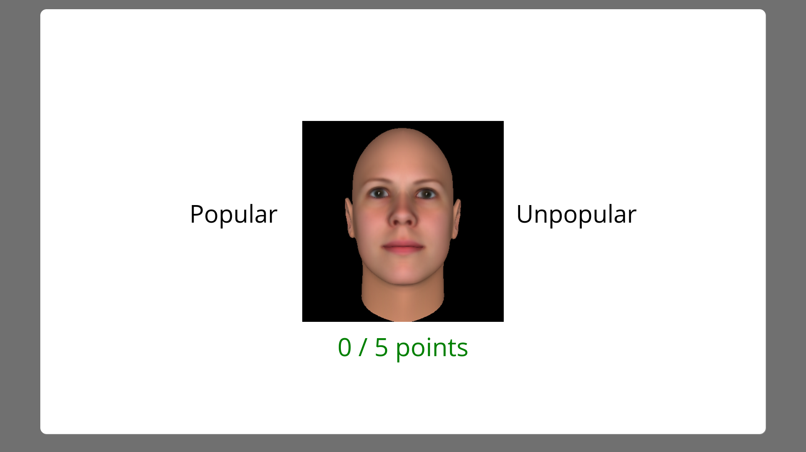

```{r setup, include = FALSE}
knitr::opts_chunk$set(
  collapse = TRUE,
  message = F, error = F,warning = F, echo = F,
  comment = "#>"
)
```

```{r load_packages_and_data}
library(probly)
library(dplyr)
library(tidyr)
library(ggplot2)
data('splt', 'splt_confidence', 'splt_dev_and_demog')

sample_labels <- c(
    'TDS1' = 'Foster-care involved adolescents',
    'TDS2' = 'Community adolescents',
    'yads' = 'College students',
    'yads_online' = 'College students - online'
)

condition_labels <- c(
    'HngT' = 'Hungry/Thirsty',
    'DtnL' = 'Dating/Looking', 
    'PplU' = 'Popular/Unpopular'
)

ethnicity_labels <- c(
    'American Indian and Alaska Native' = 'AmIndn',
    'Asian' = 'Asian',
    'Black or African American' = 'Black/AA',
    'Latinx/Hispanic' = 'Latinx/Hsp',
    'Native Hawaiian and Other Pacific Islander' = 'Pcfc Islnd',
    'Other' = 'Other',
    'White' = 'White',
    'White/Hispanic' = 'Wht/Hsp'
)

splt$condition <- factor(splt$condition, levels = names(condition_labels), labels = condition_labels)
splt$sample <- factor(splt$sample, levels = names(sample_labels), labels = sample_labels)
splt_dev_and_demog$sample <- factor(splt_dev_and_demog$sample, levels = names(sample_labels), labels = sample_labels)
splt_dev_and_demog$gender <- factor(splt_dev_and_demog$gender, levels = c(0, 1), labels = c('Male', 'Female'))
splt_dev_and_demog$ethnicity <- factor(splt_dev_and_demog$ethnicity, levels = names(ethnicity_labels), labels = ethnicity_labels)
```

```{r loadtablesandcss, results = 'asis'}
library(tables)
writeCSS(CSS = htmloptions()$CSS)
```

```{r calc_tables}
mean.na.rm <- function(x){mean(as.numeric(x), na.rm=T)}
sd.na.rm <- function(x){sd(x, na.rm=T)}
nmissing <- function(x){m <- sum(is.na(x));ifelse(m==0,'-',m)}
prct_missing <- function(x,y){pct <- 100*sum(is.na(x))/length(y);ifelse(pct==0,'\\-',pct)}
minmax.na.rm <- function(x){sprintf('[%0.0f,%0.0f]',round(min(x, na.rm = T),0), round(max(x, na.rm = T),0))}

splt_did_task <- dplyr::summarize(
    dplyr::group_by(splt, id, sample),
    ntrials = sum(!is.na(pressed_r))
)

splt_dev_and_demog_task_sum <- dplyr::full_join(
    splt_dev_and_demog,
    splt_did_task,
    by = c('SID' = 'id', 'sample')
)

splt_dev_and_demog_task_sum$gender_num <- as.numeric(splt_dev_and_demog_task_sum$gender)

splt_by_cond_samp <- dplyr::group_by(splt, condition, sample)
splt_summary_optimal_feedback <- dplyr::summarize(
    splt_by_cond_samp,
    p_optimal_correct = mean((proportion == '20_80') == (correct_r == 1))
)

sample_table <- tables::tabular(
    (Sample=sample) ~ 
        (N = 1)*Heading()*(gender) +
        (Format(digits=2)*(Age = age) + 
             Format(digits=1)*(PDSS = PDSS_pdss) + 
             Format(digits=0)*(`N~trials~` = ntrials))*Heading()*(gender)*
                  ((M = mean.na.rm) + 
                       (`SD` = sd.na.rm)), 
    data = splt_dev_and_demog_task_sum)

missing_table <- tables::tabular(
    ((Sample=sample) + 1) ~ 
        (N=1) +
             (((Age=age) + (PDSS=PDSS_pdss) + (Gender = gender_num) + (Task = ntrials))*
                  ((`N~miss~` = nmissing) + Format(digits=1)*(`%` = Percent(fn = prct_missing)))), 
    data = splt_dev_and_demog_task_sum)

optimal_press_prop_table <- tables::tabular((Condition = condition)*(Sample = sample) ~ 
                    Heading('Probability of reward')*
                    identity*Heading()*Format(digits=3)*p_optimal_correct, 
                data = splt_summary_optimal_feedback)
ethnicity_table <- tables::tabular(
    Heading('Percent (%)')*ethnicity*Heading()*Format(digits=1)*Percent(denom = 'col') ~
        1 + Heading()*(Sample = sample),
    data = splt_dev_and_demog_task_sum)
```

# Participants

Data from four samples are used in this analysis. 
The first two samples comprise foster-care-involved and community adolescents who were recruited from the greater Eugene/Springfield area for an ongoing longitudinal study investigating decision-making related to health-risking behavior (NIH grant number:). 
The third and forth samples consisted of college students who completed the study for course credit either in person, or online. 
Some participants in each sample did not provide data on all focal measures (see Table \@ref(tab:missingstats)), and so sample sizes for each analysis will differ to some extent.
Examining the table, it is clear that the proportion of missing data is small.

The full sample consists of `r sum(!is.na(splt_dev_and_demog_task_sum$SID))` participants (`r sum(splt_dev_and_demog_task_sum$gender_num==1, na.rm=T)` male) with ages between `r round(min(splt_dev_and_demog_task_sum$age, na.rm = T), 1)` and `r round(max(splt_dev_and_demog_task_sum$age, na.rm = T), 1)` years (see Table \@ref(tab:samplestats) for full details). The majority of participants in all samples identified as white, though in the both college samples this majority did not exceed 60% (Table \@ref(tab:ethnicitytable)).

(ref:missingstats) (\#tab:missingstats) Missing data from each sample for age, PDSS, and gender

(ref:samplestats) (\#tab:samplestats) Descriptive statistics on age, and PDSS for each sample

(ref:ethnicitytable) (\#tab:ethnicitytable) Race/ethnicity information by sample

```{r missingstats, results='asis'}
html(missing_table, 
     options = list(
         justification = c('l'), 
         rowlabeljustification = c('l'), 
         pad = TRUE,
         HTMLcaption = '(ref:missingstats)'))
```

```{r samplestats, results='asis'}
html(sample_table, 
     options = list(
         justification = c('l'), 
         rowlabeljustification = c('l'), 
         pad = TRUE,
         HTMLcaption = '(ref:samplestats)'))
```

```{r ethnicitytable, results='asis'}
html(ethnicity_table, 
     options = list(
         justification = c('r'), 
         rowlabeljustification = c('l'), 
         pad = TRUE,
         HTMLcaption = '(ref:ethnicitytable)'))
```


## Pubertal Development

To assess pubertal development, all participants completed the Pubertal Development Scale [PDS; @petersen1988], with the mean of five items used to indicate progress through puberty (range [1,4]). While the full sample includes a wide range of pubertal development, there are notable heterogeneity. First, it is not surprising that almost all participants in the college samples report that puberty is complete. Notably (though also unsurprisingly), females in the the adolescent samples report being further through puberty than males (Figure \@ref(fig:pdsplot)A). Most participants over the age of 18 have PDS scores indicating puberty is completed, or nearly completed (Figure \@ref(fig:pdsplot)B).

(ref:pdsplot) Pubertal development by sample and age

```{r pdsplot, fig.width=8, fig.height=5, fig.cap='(ref:pdsplot)'}
pds_plot_1 <- splt_dev_and_demog_task_sum %>%
    dplyr::mutate_at(vars(PDS_mean_score, age), funs(as.numeric)) %>%
    ggplot2::ggplot(aes(x = PDS_mean_score, fill = gender)) + 
    ggplot2::geom_density(alpha = .5, adjust = 1.7) + 
    ggplot2::scale_fill_manual(values = c('#1f78b4', '#33a02c'), 
                               labels = c('Male', 'Female'), name = '') + 
    ggplot2::facet_wrap(~sample) + 
    ggplot2::theme_minimal() + 
    ggplot2::theme(legend.position = 'bottom') + 
    ggplot2::labs(title = 'A',
                  x = 'Pubertal development scale, mean',
                  y = 'Density') + 
    ggplot2::coord_cartesian(xlim = c(1, 4))
    

pds_plot_2 <- splt_dev_and_demog_task_sum %>%
    dplyr::mutate_at(vars(PDS_mean_score, age), funs(as.numeric)) %>%
    ggplot2::ggplot(aes(x = age, y = PDS_mean_score, color = gender)) + 
    ggplot2::geom_point(alpha = .5, position = position_jitter(w=.1, h=.1)) + 
    ggplot2::scale_color_manual(values = c('#1f78b4', '#33a02c'), 
                                breaks = c('Male', 'Female'),
                                labels = c('Male', 'Female'), 
                                name = '') +
    ggplot2::scale_x_continuous(breaks = c(12, 18, 24)) + 
    ggplot2::geom_line(stat = 'smooth', 
                       method = 'gam', 
                       formula = y ~ s(x, bs = 'tp', k = 5), 
                       aes(group = gender)) + 
    ggplot2::theme_minimal() + 
    ggplot2::theme(legend.position = 'bottom') + 
    ggplot2::labs(title = 'B',
                  y = 'Pubertal development scale, mean',
                  x = 'Age (years)') + 
    ggplot2::coord_cartesian(xlim = c(12, 25), ylim = c(1, 4))
gridExtra::grid.arrange(pds_plot_1, pds_plot_2,nrow=1)
```


# Measures

## Social Probabilistic Learning Task

The Social Probabilistic Learning Task (SPLT) is a standard reinforcement learning paradigm using several stimulus-word pairings that are grouped by motive relevance. Common probabilistic reinforcement learning paradigms focus on estimating parameters that govern learning associations between stimuli using abstract images and nonsocial categories as the conditioned stimulus [e.g., a weather prediction of 'sunny' or 'rainy' @knowlton1996]. In the SPLT, motive context is manipulated by pairing human faces with state or trait words related to mate-seeking and status motives. The purpose of this manipulation is to examine how this motive framing alters learning, especially across adolescent development, as well as how individual differences in learning are related to the measures of attitudes and behavior outline below.

On each trial, the participant sees one of six faces, along with two labels, and is asked to classify the face using one of the two labels. The labels are: *Hungry* versus *Thirsty* (control condition that is nonsocial, or only minimally social), *Dating* versus *Looking* for someone to date (mate-seeking), and *Popular* versus *Unpopular* (status). After choosing the label, the participant is given feedback that they were correct and earned either 1/1 point or 5/5 points, or that they were incorrect and earned 0/1 point or 0/5 points (Figure \@ref(fig:trialexample)). Each face is probabilistically associated with one label with P(Correct | Choice = Label) = .80. That is, there is a probabilistically optimal choice response, which precludes a memorization strategy and results in more automatic reinforcement learning [@knowlton1996]. The participant is instructed that "the same word goes with the same picture most of the time, but not always" and to "try to guess correctly as often as you can to get the most points."

(ref:trialexample) Example of a trial on the SPLT

```{r trialexample, dpi=300, fig.cap='(ref:trialexample)'}

```

To ensure engagement with the stimulus faces, 3 unambiguously male and 3 unambiguously female faces drawn from a set of faces evaluated by @todorov2008. Target faces were drawn from a subset of those highest in likeability and attractiveness ratings, and were selected to have roughly equal euclidean distance from one another on the other dimensions on which they had been rated (e.g., trustworthiness). Essentially, the faces were selected to be similarly salient, as well as similarly distinct from one another such that one or two particularly unique face did not overwhelm the learning effect of the motives. On each run of the task (i.e., for each participant), one male and one female face was randomly assigned to each label within condition (control, mate-seeking, status). On each trial, the participant had 3.5 seconds to respond, and was shown response feedback for 1 second. The task comprises a total of 384 trials across 8 blocks.

The receipt of the reward for choosing the optimal response (that is, the response that most often generated a reward) was probabilistic. Across conditions and samples, the observed probability of reward receipt for an optimal choice was very close to the generative _p_ = .80 (Table \@ref(tab:optpressstats)). Reaction times for all participants can be seen in Figure \@ref(fig:reactiontime), with an overall mean of `r round(mean(dplyr::filter(splt, rt > 0, rt<3600)$rt)/1000, 2)`s (SD = `r round(sd(dplyr::filter(splt, rt > 0, rt<3600)$rt)/1000, 2)`s). Most participants completed all trials with only occasional missed responses (Figure \@ref(fig:totaltrials)). For a small number of participants, far fewer trials were obtained (min = `r min(dplyr::summarize(group_by(dplyr::filter(splt, !is.na(pressed_r)), id), n = n())$n)`, with n = `r sum(dplyr::summarize(group_by(dplyr::filter(splt, !is.na(pressed_r)), id), n = n())$n < 350)` having fewer than 350 trials) either as a result of early termination, or because of computer error during data file saving.

(ref:optpressstats) (\#tab:optpressstats) Probability that an optimal choice results in reward


```{r optpressstats, results='asis'}
html(optimal_press_prop_table, 
     options = list(
         justification = c('l'), 
         rowlabeljustification = c('l'), 
         pad = TRUE,
         HTMLcaption = '(ref:optpressstats)'))
```


(ref:reactiontime) Distribution of reaction times for all participants. The vertical line set a 1s, which is close to the mean reaction time across all samples.

```{r reactiontime, fig.width=10.5, fig.height=8, cache=T, fig.cap='(ref:reactiontime)', cache=T}
ggplot2::ggplot(
    dplyr::filter(splt, rt > 0),
    ggplot2::aes(x = rt/1000)) +
    ggplot2::geom_vline(xintercept = 1, size = .5, color = '#666666') +
    ggplot2::geom_histogram(binwidth = .1, fill = 'black') +
    ggplot2::theme_minimal() +
    ggplot2::theme(strip.background = element_blank(),
                   strip.text = element_blank()) +
    ggplot2::scale_x_continuous(breaks = c(0, 1, 2)) +
    facet_wrap(~id, ncol = 20) +
    coord_cartesian(x = c(0, 2)) +
    labs(x = 'Trial reaction-time (s)',
         y = 'Count')
```

(ref:totaltrials) Number of trials for each participant in each condition. The horizontal Line indicates maximum number of trials possible.

```{r totaltrials, fig.width=10.5, fig.height=8, cache=T, fig.cap='(ref:totaltrials)', cache=T}
max_number_of_trials <- max(
    dplyr::summarise(
        dplyr::group_by(
            dplyr::filter(splt, !is.na(pressed_r)),
            id, condition),
        n_trials = n())$n_trials
    )


ggplot2::ggplot(
    dplyr::filter(splt, !is.na(pressed_r)),
    ggplot2::aes(x = condition)) +
    ggplot2::geom_hline(yintercept = max_number_of_trials, color = '#666666') +
    ggplot2::geom_bar(fill = '#bbbbbb') +
    ggplot2::theme_minimal() +
    ggplot2::theme(strip.background = element_blank(),
                   strip.text = element_blank(),
                   axis.text.x = element_text(angle = 360-45, hjust = 0)) +
    facet_wrap(~id, ncol = 20) +
    labs(x = 'Condition',
         y = paste0('Number of trials (line at max = ', max_number_of_trials, ')'))
```

# References
